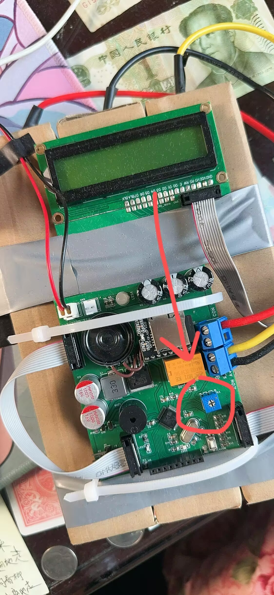

# STM-C4 Ver4.0

## 中文
基于 STM32F103C8T6 的 CS2 C4 光电模型，第4版。还原度约95%，相较于先前版本，优化了显示屏排线宽度，使用多色LED，使用无源蜂鸣器（可以发出不同音调），添加了“拆弹器”支持。硬件方面使用了集成的电源电路，以及集成在PCB上的控制器取代原先的整个开发板。软件方面改进：倒计时使用了更还原的公式，修改了更好的动画，添加了更多可配置选项，使用了更还原的显示屏动画。

GitHub 仓库（程序/文档）：https://github.com/AzidoPP/STM-C4  
OSHWHUB 硬件开源地址：https://oshwhub.com/azidopp/CS2-C4

[English](#english)
### 实物图：

### 快速开始
1. PCB 打样
   - 主板 Gerber：[PCB_Gerber/Gerber_C4_MainBoardV4.1.zip](PCB_Gerber/Gerber_C4_MainBoardV4.1.zip)
   - LCD 转接板 Gerber：[PCB_Gerber/Gerber_LCD1601_AdapterBoardV4.0.zip](PCB_Gerber/Gerber_LCD1601_AdapterBoardV4.0.zip)
   - 立创EDA 原始工程文件（本仓库）：[EasyEDA_proj](EasyEDA_proj/)
   - 详情工程请参考OSHWHUB开源硬件平台[工程](https://oshwhub.com/azidopp/CS2-C4)
2. 采购 BOM
   - BOM 文件：[BOM/BOM.xlsx](BOM/BOM.xlsx)
   - 9V 电池建议使用碱性电池（输出电流更稳定）
3. 焊接与装配
   - LCD1601 转接板焊接示例：
     
     
     
   - 3D 打印外壳/填充件（可选）：见 [3DP_Models](3DP_Models/)
   - 完整组装：
     
4. 烧录固件
   - Keil 工程：[Keil_proj/c4](Keil_proj/c4/)
   - ST-Link V2 接口位置：
     
   - 引脚顺序：3.3V / SWDIO / SWCLK / GND
   - 烧录固件后，如果LCD1601显示屏不显示，请旋转电位器调整屏幕对比度，左右旋转，直到出现清晰的文字。
     
5. MP3 音效（可选）
   - 将 [TFCard_Files/](TFCard_Files/) 内容拷贝到 TF 卡根目录
   - 详细说明见：[TFCard_Files](TFCard_Files/)
6. 配置与修改
   - 用户配置说明：[`CONFIG.md`](CONFIG.md)
   - 默认配置定义文件：[`Keil_proj/c4/user/config.h`](Keil_proj/c4/user/config.h)
   - 可在不重新烧录的情况下修改单个配置（上电时按住 `#` 进入配置模式）
   - 新增倒计时数字显示开关：`CONFIG_DIGITAL_COUNTDOWN_ENABLE`

### 基础玩法
- 上电阶段仅蜂鸣器提示（不播放 MP3），LED为黄色呼吸灯模式。
- 输入任意 7 位密码，作为“下包密码”。
- 输入完成后进入倒计时（默认15秒，可配置），期间LED和蜂鸣器会逐渐急迫。
- 倒计时期间有三种拆弹方式：
  - 输入拆弹：再次输入与下包一致的密码即可拆弹成功。
  - 手动拆弹：长按 `#` 开始拆弹，持续10秒后成功。
  - 外部拆弹器：外部拆弹输入有效时开始拆弹，持续5秒即成功。
- 拆弹成功播放序列：拆弹成功音（可单独开关）→（可选）CT音乐盒→（可选）CT胜利播报。
- 倒计时结束未拆弹播放序列：
  - 启用T音乐盒：播放“爆炸+T音乐盒”整合音频→（可选）T胜利播报。
  - 未启用T音乐盒：播放纯爆炸音效→（可选）T胜利播报。

### 配置
- 用户配置指南（含编号与操作步骤）：[`CONFIG.md`](CONFIG.md)
- 默认配置定义文件：[`Keil_proj/c4/user/config.h`](Keil_proj/c4/user/config.h)
- 技术说明：[`V4说明.md`](V4说明.md)

### 详细说明
更多细节与原理说明请移步[Github仓库](https://github.com/AzidoPP/STM-C4)查看：[V4说明.md](V4说明.md)

### 免责声明
本项目为外观光电复刻模型，不具备任何真实功能或危险性。  
任何改装、滥用或非法使用与原作者无关，原作者不承担责任。

---

## English
An STM32F103C8T6-based CS2 C4 appearance model (V4.0). About 95% visual accuracy. Compared to the previous version, this revision optimizes the LCD ribbon width, uses multi-color LEDs, adds a passive buzzer for distinct tones, and introduces an external defuser option. The hardware integrates the power circuit and uses a PCB-mounted controller instead of a full dev board. On the software side, the countdown uses a more accurate formula, smoother animations, and more configurable options with a more authentic LCD effect.

GitHub repo (firmware/docs): https://github.com/AzidoPP/STM-C4  
OSHWHUB hardware page: https://oshwhub.com/azidopp/CS2-C4

[中文](#中文)

### Real Picture：

### Quick Start
1. PCB fabrication
   - Main board Gerber: [PCB_Gerber/Gerber_C4_MainBoardV4.1.zip](PCB_Gerber/Gerber_C4_MainBoardV4.1.zip)
   - LCD adapter Gerber: [PCB_Gerber/Gerber_LCD1601_AdapterBoardV4.0.zip](PCB_Gerber/Gerber_LCD1601_AdapterBoardV4.0.zip)
   - EasyEDA original project files (this repo): [EasyEDA_proj](EasyEDA_proj/)
   - See OSHWHUB for the full hardware [project files](https://oshwhub.com/azidopp/CS2-C4)
2. BOM purchase
   - BOM file: [BOM/BOM.xlsx](BOM/BOM.xlsx)
   - 9V alkaline batteries are recommended for more stable current output
3. Soldering & assembly
   - LCD1601 adapter soldering example:
     
     
     
   - 3D printed shell/fillers (optional): see [3DP_Models](3DP_Models/)
   - Fully assembled board:
     
4. Flash firmware
   - Keil project: [Keil_proj/c4](Keil_proj/c4/)
   - ST-Link V2 header location:
     
   - Pin order: 3.3V / SWDIO / SWCLK / GND
   - After flashing the firmware, if the LCD1601 shows no text, rotate the potentiometer in either direction to adjust the display contrast until the text is clear.
     
5. MP3 audio (optional)
   - Copy [TFCard_Files/](TFCard_Files/) contents to the TF card root
   - Details: [TFCard_Files](TFCard_Files/)
6. Configuration and tuning
   - User guide: [`CONFIG.md`](CONFIG.md)
   - Default configuration source: [`config.h`](Keil_proj/c4/user/config.h)
   - Supports single-item configuration update without reflashing (hold `#` during power-on)
   - Added digital countdown toggle: `CONFIG_DIGITAL_COUNTDOWN_ENABLE`

### Basic Gameplay
- Startup uses buzzer only (no MP3), while LED breathes in yellow.
- Enter any 7-digit code as the “plant” password.
- After entry, the countdown starts (default 15s, configurable); the LED and buzzer become more urgent.
- During the countdown, there are three defuse methods:
  - Password defuse: enter the same password again to defuse successfully.
  - Manual defuse: long press `#` to start; succeed after 10 seconds.
  - External defuser: when the external defuse input is active, hold for 5 seconds to succeed.
- Defuse-success sequence: defuse-success cue (separate toggle) -> (optional) CT music box -> (optional) CT win announcement.
- Explosion sequence:
  - With T music box enabled: play integrated explosion+music-box track -> (optional) T win announcement.
  - Without T music box: play pure explosion track -> (optional) T win announcement.

### Configuration
- User-facing configuration guide: [`CONFIG.md`](CONFIG.md)
- Technical notes: [`V4说明.md`](V4说明.md)
- Default configuration source: [`config.h`](Keil_proj/c4/user/config.h)

### Detailed Docs
For deeper details and theory, go to [Github repo](https://github.com/AzidoPP/STM-C4) and see the Chinese document: [V4说明.md](V4说明.md)

### Disclaimer
This project is a visual/electronic replica and does not have any real functionality or danger.  
Any modification, misuse, or illegal use is not associated with the author, and the author assumes no liability.
